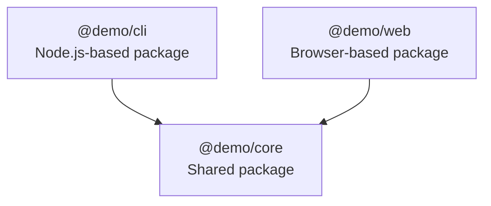

# TypeScript NPM Workspace

[](https://github.com/Soul-Master/ts-npm-workspaces/actions/workflows/main.yml)


A minimal TypeScript monorepo showing TypeScript composite projects/NPM packages for Node.js, browser and shared environment.



## Getting started

```
npm start
```

## Run it

**CLI module**

```
npm start -w @demo/cli
```

**Web module**

```
npm start -w @demo/web
```

**All possible packages**

```
npm start --workspaces --if-present
```
